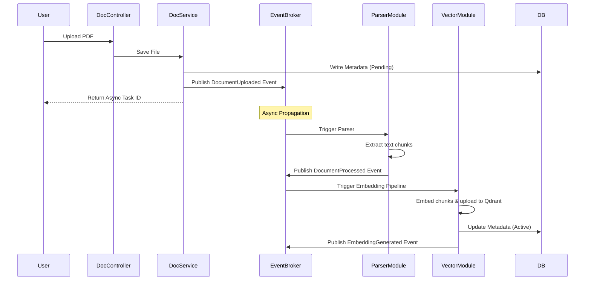

# System Architecture Specification
## Document ID: PL-ARCH-001 | Version: 1.0.0 | Status: DRAFT-FOR-REVIEW
## Target System: Enterprise AI Knowledge Management Platform

---

## 1. Architecture Overview

The system is designed as a **Modular Monolith** backend built with Java 21 and Spring Boot 3, and a decoupled **Next.js 15** frontend. 

### Why a Modular Monolith?
For a Version 1 project, a Modular Monolith offers the ideal balance of operational simplicity and high performance while preserving long-term structural options. 

```
                                  +-----------------------+
                                  |    Next.js Client     |
                                  +-----------+-----------+
                                              | (HTTP REST / SSE)
                                              v
+---------------------------------------------+----------------------------------------------+
| Spring Boot Backend Monolith                                                               |
|                                                                                            |
|   +-----------------------+   +-----------------------+   +-----------------------+        |
|   |      auth-module      |   |     document-module   |   |        rag-module     |        |
|   +-----------------------+   +-----------------------+   +-----------------------+        |
|               ^                           ^                           ^                    |
|               |                           |                           |                    |
|               +---------------------------+---------------------------+                    |
|                                           v (In-Process Spring Events)                     |
|                               +-----------+-----------+                                    |
|                               |      event-broker     |                                    |
|                               +-----------------------+                                    |
+-------------------------------------------+------------------------------------------------+
                                            |
                         +------------------+------------------+
                         |                  |                  |
                         v                  v                  v
                  +------+------+    +------+------+    +------+------+
                  | PostgreSQL  |    |    Redis    |    |   Qdrant    |
                  | (Relational)|    |  (Caching)  |    |   (Vector)  |
                  +-------------+    +-------------+    +-------------+
```

1. **Operationally Lightweight:** A single deployable JAR simplifies CI/CD pipelines, minimizes infrastructure costs, and streamlines developer onboarding.
2. **Strict Encapsulation:** Unlike a standard monolith where code degenerates into a "spaghetti" layout, a Modular Monolith enforces explicit boundaries between functional modules using compile-time checks (e.g., Maven modules).
3. **Low Latency:** In-process Java memory calls eliminate the network serializations and round-trip overhead of microservices, satisfying the sub-second search latency requirements.
4. **Microservices Ready:** The layout is designed to allow any high-load module (e.g., the parser or vector connector) to be extracted into a standalone containerized service in the future.

---

## 2. Architectural Principles

* **Clean Architecture:** High-level policy is separated from delivery mechanisms. The inner Core (Domain Entities) has zero dependencies on databases, Web REST frameworks, or ORM annotations.
* **Lightweight Domain-Driven Design (DDD):** Modules represent distinct bounded contexts. Relationships are maintained via Aggregate Roots, and cross-boundary references use ID keys rather than object graphs.
* **SOLID Design Rules:** Every class has a single responsibility. Interfaces define module boundaries, preventing leakage of concrete implementations.
* **Dependency Rule:** Source code dependencies always point inward. The business domain layer is independent of database adapters and third-party AI frameworks.
* **Feature-Based Modularization:** Code is structured by business capability (e.g., `documents`, `rag`, `billing`) rather than framework layer (`controllers`, `services`, `repositories`).
* **In-Process Event-Driven Communication:** Modules decouple operations asynchronously using Spring Application Events. This limits direct compile-time coupling and facilitates future message-queue integration.
* **Future Microservice Readiness:** database tables are partitioned logically per module, and direct database joins across modules are strictly forbidden.

---

## 3. Complete Module Architecture

The modular monolith is divided into distinct, logically isolated modules:

```
+------------------+      +------------------+      +------------------+
|   auth-module    | ---> | document-module  | ---> |    rag-module    |
| (SSO, Auth, ACL) |      | (Ingestion, MD)  |      |  (Embedding, AI) |
+------------------+      +------------------+      +------------------+
```

| Module | Core Purpose | Dependencies | Core Events Produced | Core Events Consumed |
| :--- | :--- | :--- | :--- | :--- |
| **Authentication & Authorization (`auth`)** | User identity, RBAC checks, tenant mapping, and document ACL verification. | None | `UserCreated`, `PermissionChanged` | None |
| **Organization Management (`org`)** | Organization properties, billing limits, and workspace seats. | `auth` | `TenantDeactivated` | None |
| **Document Processing (`document`)** | Raw file uploads, parsing, metadata extraction, and version control. | `auth` | `DocumentUploaded`, `DocumentProcessed` | None |
| **Knowledge Base (`kb`)** | File directory hierarchy maps, tag bindings, and ACL indexing. | `auth`, `document` | `FolderUpdated` | `DocumentProcessed` |
| **Vector & AI RAG (`rag`)** | Embedding updates, Qdrant routing, and prompt generation via Gemini 2.5 Flash. | `auth`, `document` | `EmbeddingGenerated` | `DocumentProcessed` |
| **Search Engine (`search`)** | Hybrid queries combining dense Qdrant vector outputs with sparse PostgreSQL token matches. | `auth`, `rag` | `SearchExecuted` | None |
| **Analytics (`analytics`)** | Query telemetry logging, cost assessments, and active search failure queues. | `auth`, `search`, `rag` | None | `SearchExecuted`, `EmbeddingGenerated` |
| **Notifications (`notification`)** | In-app alerts, email deliveries, and active socket updates. | `auth` | `NotificationCreated` | `DocumentProcessed`, `UserCreated` |
| **Audit Logs (`audit`)** | Immutable log tracking of read/write events. | `auth` | `AuditRecorded` | Any System Event |
| **System & AI Configurations (`config`)** | Global environment setups, prompts, and model variables. | `auth` | `ConfigUpdated` | None |

---

## 4. Layered Architecture

Within each backend module, code is organized into distinct layers:

```
+-----------------------------------------------------------------------------+
| Presentation Layer (REST Controllers, WebSocket Handlers, SSE Streaming API) |
+-------------------------------------+---------------------------------------+
                                      |
                                      v
+-------------------------------------+---------------------------------------+
| Application Layer (Use Cases, Application Services, Transaction Boundaries)  |
+-------------------------------------+---------------------------------------+
                                      |
                                      v
+-------------------------------------+---------------------------------------+
| Domain Layer (Entities, Value Objects, Domain Events, Domain Services)       |
+-----------------------------------------------------------------------------+
                                      ^
                                      | (Dependency Inversion)
+-------------------------------------+---------------------------------------+
| Infrastructure Layer (DB Adapters, Qdrant Clients, Redis Caches, Spring AI) |
+-----------------------------------------------------------------------------+
```

* **Presentation Layer:** Exposes REST endpoints, SSE streams, and WebSocket adapters. Converts JSON transport bodies into application command models.
* **Application Layer:** Orchestrates business transactions. Defines input ports, coordinates domain actions, maps entities, and executes updates.
* **Domain Layer:** Contains core business logic, domain models, and aggregates. Fully decoupled from libraries and databases.
* **Infrastructure Layer:** Implements adapters for external resources (e.g., PostgreSQL repositories, Redis caching structures, Qdrant indexing clients, Spring AI connectors).

---

## 5. Package Structure

The backend package layout follows feature-based organization, maintaining separation of concerns:

```
com.enterprise.platform
├── AppMonolithApplication.java         # Monolith entrypoint
├── core                                 # Shared kernel definitions
│   ├── domain                           # Shared value objects
│   ├── exception                        # Global exceptions
│   └── event                            # Generic event schemas
└── modules                              # Feature modules
    ├── auth                             # Authentication module
    │   ├── api                          # Presentation controllers & DTOs
    │   ├── domain                       # User, Role, Tenant domain objects
    │   ├── service                      # Use-case handlers
    │   └── adapter                      # JPA repositories & SSO handlers
    ├── document                         # Ingestion and Parsing module
    │   ├── api
    │   ├── domain
    │   ├── service
    │   └── adapter                      # PDFBox parser, block storage adapters
    ├── rag                              # RAG & AI module
    │   ├── api
    │   ├── domain
    │   ├── service                      # Embedding and LLM services
    │   └── adapter                      # Qdrant client, Spring AI configuration
    └── search                           # Hybrid search module
        ├── api
        ├── domain
        ├── service                      # RRF ranking logic
        └── adapter                      # DB Full Text Search repositories
```

---

## 6. Frontend Architecture

The Next.js 15 client operates as a decoupled single-page application (SPA):

```
/frontend
├── app/                                 # Next.js App Router root
│   ├── layout.tsx                       # Global theme providers
│   ├── page.tsx                         # Landing page
│   ├── (auth)/                          # Authenticated layouts
│   │   ├── login/
│   │   └── sso/
│   └── (dashboard)/                     # Protected dashboard routes
│       ├── page.tsx
│       ├── search/
│       └── chat/
├── components/                          # UI components
│   ├── ui/                              # shadcn/ui base controls
│   └── features/                        # Feature-specific components
│       ├── chat-panel.tsx
│       └── document-viewer.tsx
├── hooks/                               # Custom React hooks (e.g., useRAGChat.ts)
├── providers/                           # Theme, Auth, Query providers
├── services/                            # Axios API wrappers and Event handlers
└── store/                               # Jotai state containers (minimizing state scopes)
```

---

## 7. AI Workflow Architecture

```
User Query ---> Input Filter ---> Embedding Generation ---> Qdrant Search (Filtered by ACLs)
                                                                 |
Result Generation <--- Gemini 2.5 Flash <--- Prompt Assembly <---+ Chunks retrieved
```

1. **Prompt Builder:** Templates prompt inputs (e.g., context chunks, guidelines, chat history variables).
2. **Context Builder:** Retrieves relevant document chunks and constructs contextual references for the LLM prompt.
3. **Retriever:** Queries Qdrant using the query vector and user permission scopes.
4. **Citation Generator:** Parses returned vector metadata matching the generated output, rendering inline reference coordinates.
5. **Conversation Manager:** Coordinates thread state, caches past messages, and handles chat window bounds.
6. **Embedding Pipeline:** Generates high-dimensional vectors for query inputs using Google Gemini Embedding APIs.
7. **Safety Filters:** Runs checks to prevent profanity, prompt injection, and data exfiltration before calling LLMs.

---

## 8. Internal Event Flow

Asynchronous operations communicate using decoupled application events. This layout minimizes compile-time dependencies:



### Event Producers & Consumers

| Event | Publisher | Main Subscribers | Purpose |
| :--- | :--- | :--- | :--- |
| `DocumentUploaded` | `document-module` | `parser-module` | Signals a new file is staged and ready for text extraction. |
| `DocumentProcessed` | `parser-module` | `vector-module`, `notification-module` | Signals text extraction is complete; triggers chunk vectorization. |
| `EmbeddingGenerated` | `vector-module` | `search-module`, `audit-module` | Signals indexing is complete; makes document available for search queries. |
| `UserCreated` | `auth-module` | `notification-module`, `audit-module` | Triggers user welcome notifications and audit logging. |
| `PermissionChanged` | `auth-module` | `search-module` | Triggers search cache invalidation for the affected user. |
| `AuditRecorded` | Any Module | `audit-module` | Records system events in the immutable audit log. |

---

## 9. Logical Request Flows

### 9.1 Authentication & SAML SSO Flow
1. Next.js requests login redirection parameters from the Spring Boot `auth` module.
2. Spring Boot redirects the client browser to the external SAML Identity Provider (IdP).
3. The IdP verifies credentials and returns a signed XML assertion to the Spring Boot callback route.
4. Spring Boot validates the IdP signature, parses user roles, generates a JWT signed with an RSA-256 private key, and sets it in an HTTP-only secure cookie.
5. The browser is redirected back to the `/dashboard` route, accessing secure APIs using the cookie token.

### 9.2 Secure RAG Chat Flow
1. User enters a query via the chat client interface.
2. Next.js client sends the query and session details to the backend RAG API endpoint.
3. Spring Security validates the request cookie and injects the user's authentication context into the security thread.
4. The RAG controller retrieves the user's document permissions from the database.
5. The system calls the embedding API to generate a vector representation of the user query.
6. The query vector is sent to Qdrant alongside a metadata filter containing the user's authorization scopes (pre-filtering).
7. Qdrant returns matching text chunks that the user is authorized to access.
8. The RAG service constructs a prompt template combining the user query and retrieved context chunks.
9. Prompt payload is sent to Gemini 2.5 Flash, streaming the response back to the client using Server-Sent Events (SSE).
10. The citation manager processes references to source document IDs, rendering inline citation links in the UI response.

---

## 10. Security Architecture

```
User Request ---> Next.js JWT Validate ---> HTTPS (TLS 1.3) ---> Spring Security Filter
                                                                        |
Authorization Granted <--- SQL Row Level Filter <--- Qdrant ACL Intercept <---+
```

* **Authentication Handshake:** SAML 2.0 assertions map to local user models. Session validation uses signed JWT payloads.
* **Authorization (RBAC & ACLs):** Roles limit structural operations (e.g., viewing admin logs). Document-level ACL lists are embedded as payload vectors inside Qdrant indexes, ensuring query pre-filtering.
* **Encryption Standards:** Data in transit is secured via HTTPS (TLS 1.3). Data at rest is encrypted using AES-256 for PostgreSQL columns and staged storage partitions.
* **Secrets Isolation:** Application credentials and Gemini API keys are injected at runtime using environment variables. Secrets are kept out of repository code files.
* **Threat Mitigation:** Inputs are sanitized to prevent SQL injection and XSS. Prompt payloads segment user strings using isolation markers to prevent prompt injection. Ingestion processes block execution permissions on staged directories to prevent file upload exploits.

---

## 11. Error Handling Architecture

The system uses a centralized error handler to manage exceptions across layers:

```
[Exception Raised] ---> GlobalExceptionHandler ---> Log Stack Trace (Internal)
                                   |
                                   +---> Map to User-Friendly JSON Response
```

* **Business Exceptions:** Explicit models (`DocumentNotFoundException`, `TenantLimitExceededException`) map directly to REST status codes (e.g., 404, 409).
* **Validation Failures:** Spring binding exceptions yield structured validation errors listing fields and corresponding constraint messages.
* **AI & Infrastructure Failures:** Timeouts or endpoint connection issues are handled gracefully. The system logs details internally and returns friendly, secure messages to clients without exposing system details.
* **Retry Strategies:** Asynchronous API integrations (such as vector embedding requests) use exponential backoff retry patterns before flagging operations as failed.

---

## 12. Logging Architecture

The system implements structured JSON logging to simplify search queries and indexing across environments:

* **Correlation IDs:** A unique tracing key (`X-Correlation-ID`) is generated at the gateway and injected into every log message throughout the request lifecycle.
* **Log Layers Configuration:**
  * *Presentation Layer:* Logs route accesses, client IPs, correlation IDs, and response codes.
  * *Application Layer:* Logs use case executions, transaction bounds, and validation checks.
  * *Infrastructure Layer:* Logs query latencies, raw database timeouts, and external API requests.
* **PII Redaction:** Structured log filters strip passwords, SSO tokens, and file text contents before writing to output streams.

---

## 13. Configuration Strategy

* **Spring Profiles:** Configures database paths, caching behavior, and mock adapters per environment using profiles (`dev`, `test`, `prod`).
* **External Configs:** Injected from container settings or configuration managers, keeping keys out of source control.
* **Feature Flags:** Manages feature availability (e.g., testing new parsing algorithms) using configuration flags without redeploying code.

---

## 14. Testing Strategy

* **Unit Testing:** Focuses on business rules, text parsing logic, and prompt assembly formatting. Replaces external databases and LLM APIs with mocked adapters.
* **Integration Testing:** Verifies modular boundaries, security filter mappings, and transaction limits using local test containers (PostgreSQL, Redis, Qdrant).
* **AI Service Testing:** Validates prompt templates and citation generators against pre-configured mock LLM response scopes.
* **Frontend Testing:** Uses Jest for unit tests and Playwright for cross-browser integration and accessibility checking.
* **End-to-End Testing:** Validates critical user journeys (login, ingestion, search, RAG chat) in a sandbox environment.

---

## 15. Deployment Architecture

The monorepo uses Docker containerization to simplify scaling and infrastructure management:

```
                  +----------------------------------+
                  |           Docker Engine          |
                  |                                  |
                  |   +--------------------------+   |
                  |   | Next.js Client Container |   |
                  |   +------------+-------------+   |
                  |                | (HTTP)          |
                  |                v                 |
                  |   +------------+-------------+   |
                  |   | Spring Boot Monolith     |   |
                  |   +------------+-------------+   |
                  |                |                 |
                  +----------------|-----------------+
                                   |
                  +----------------v-----------------+
                  |      External Infrastructure     |
                  |  (PostgreSQL, Qdrant, Redis)     |
                  +----------------------------------+
```

* **Development (Docker Compose):** Spins up a local client instance, backend monolith, PostgreSQL, Redis, and Qdrant in isolated dev networks.
* **Production Deployment:** Client and backend run as separate, auto-scalable container instances. External state stores (PostgreSQL, Redis, Qdrant) use managed enterprise database services to ensure high availability and automatic backups.

---

## 16. Scalability Strategy

The modular monolith is designed to scale horizontally:
1. **Stateless Operations:** Backend instances do not write local session files, allowing the gateway to load-balance traffic dynamically across active containers.
2. **Asynchronous Task Offloading:** Heavy ingestion processes are handled by background worker threads to keep the UI query path clear of bottlenecks.
3. **Database Scalability:** PostgreSQL tables use organization and tenant-based indexing to ensure fast search response times as database records grow.
4. **Vector Database Sharding:** Uses namespace partitions in Qdrant to organize vectors by tenant, optimizing index query lookups.

---

## 17. Future Migration Strategy

If specific business modules require independent scaling due to load differences (e.g., intensive file parsing loads), the modular monolith can be split into microservices without rewriting core logic:

```
               [Modular Monolith JAR]
                         |
                         +---> Extract parser-module ---> [Standalone Parser Service]
                         |
                         +---> Extract rag-module    ---> [Standalone RAG Service]
```

1. **Extract Maven Modules:** Convert the target module package into a standalone Spring Boot project.
2. **Implement Network Interfaces:** Replace in-process Java method calls with REST APIs or gRPC interfaces.
3. **Migrate Events to Message Brokers:** Update the Spring Application Event publisher to send events to an external message broker (e.g., RabbitMQ, Apache Kafka).
4. **Isolate Relational Tables:** Move the target module's PostgreSQL tables to a dedicated database instance. This is made simple because cross-module database joins are forbidden in V1.
